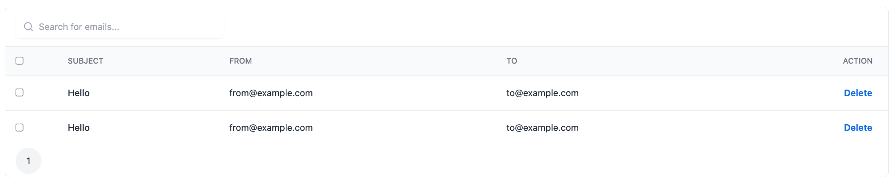

# aws-ses-local-go


## CLI

### v1

```shell
aws ses send-email \
--to from@example.com \
--from to@example.com \
--subject "subject" \
--text "body" \
--endpoint-url "http://localhost:8080"
```

```shell
aws ses send-raw-email \
--raw-message file://./scripts/message.json \
--endpoint-url "http://localhost:8080"
```

### v2

```shell
aws sesv2 send-email \
--from-email-address "example@example.com" \
--destination "ToAddresses=example@example.com" \
--content "Simple={Subject={Data=MailTitle,Charset=utf-8},Body={Text={Data=Test,Charset=utf-8}}}" \
--endpoint-url "http://localhost:8080"
```

## GUI



## other

- [docker hub](https://hub.docker.com/repository/docker/19992240/aws-ses-local-go/general)
